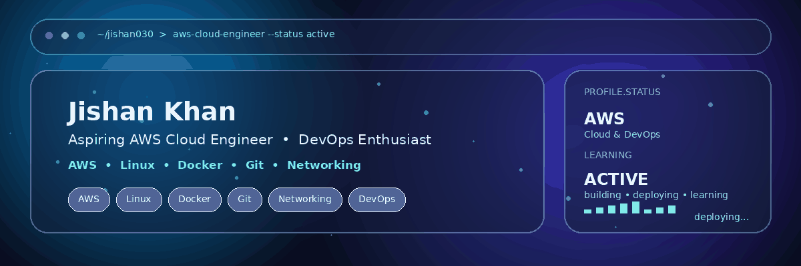

<div align="center">



# Jishan Khan

### ☁️ Aspiring AWS Cloud Engineer &nbsp;|&nbsp; 🚀 DevOps Enthusiast

<p>
  <a href="https://github.com/jishan030">
    
  </a>
  
  
</p>

</div>

---

## 👨‍💻 About Me

I'm an **Aspiring AWS Cloud Engineer** focused on building practical Cloud & DevOps skills.

- ☁️ Learning and practicing **AWS Cloud**
- 🐧 Working with **Linux & server administration**
- 🐳 Practicing **Docker & containerization**
- 🔧 Using **Git & GitHub** for version control
- 🌐 Building knowledge of **Networking & Cloud Infrastructure**
- 🚀 Turning theory into hands-on projects and labs

---

## 🛠️ Tech Stack

<div align="center">

| Cloud | DevOps & Containers | Systems & Tools |
|:---:|:---:|:---:|
|  |  |  |
|  |  |  |
|  |  |  |

</div>

---

## 🚀 Featured Projects

### 🐧 Module 2 — Linux Server

Hands-on practice with **Linux, networking and cloud infrastructure**.

🔗 [View Repository](https://github.com/jishan030/module-2-linux-server)

### ☁️ AWS Cloud Labs

Practical AWS learning with services such as **EC2, SSM, IAM and networking**.

> More cloud projects are being built and added regularly.

---

## 📈 GitHub Stats

<div align="center">


</div>

---

## 🎯 Currently Learning

```text
AWS Cloud        ███████████████░░░░   Hands-on
Linux            ██████████████░░░░░   Practicing
Networking       ████████████░░░░░░░   Building
Docker           ███████████░░░░░░░░   Practicing
DevOps           ██████████░░░░░░░░░   Learning
```

---

## 🧭 My Cloud Journey

**Learn → Practice → Build → Deploy → Improve**

I'm continuously working on practical projects to move from **learning Cloud concepts to building real-world infrastructure**.

---

<div align="center">

### ⚡ Building my Cloud & DevOps journey, one project at a time.

⭐ If you find my work useful, feel free to explore my repositories!

</div>
